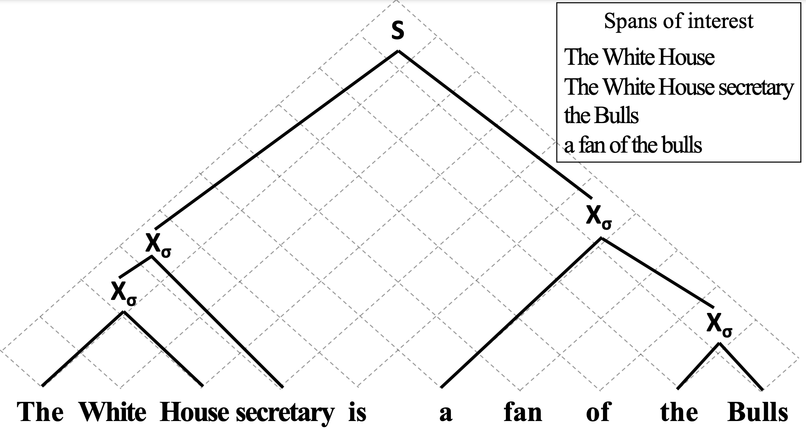

## A Structured Span Selector

https://arxiv.org/pdf/2205.03977.pdf

This repository contains the open-sourced official implementation of our **structured span selector** paper:

[A Structured Span Selector](https://arxiv.org/abs/2205.03977) (NAACL 2022).  
_Tianyu Liu, Yuchen Eleanor Jiang, Ryan Cotterell, and Mrinmaya Sachan_


## Overall idea

For all **span selection** tasks (e.g. coreference resolution, semantic role labelling, question answering), we learn the latent **context-free grammar** of the spans of interest. The search space of spans $\mathcal{O}(n^2)$ is reduced to the space of nonterminals $\mathcal{O}(n)$.




## Installation

First of all:
```bash
   git clone https://github.com/lyutyuh/structured-span-selector.git
```

1. Create a virtual environment with Conda
```bash
    conda create -n sss --file requirements_conda.txt -c conda-forge
```

2. Activate the new environment
```bash
    conda activate sss
```

3. **Install genbmm with [inside-outside algorithm extension](https://github.com/lyutyuh/genbmm)**
```bash
    pip install git+https://github.com/lyutyuh/genbmm
```


## Training

```bash
    python run.py spanbert_large 0
```

## Evaluating

```bash
    python evaluate.py spanbert_large <checkpoint> 0
```


## Citing

If you find this repo helpful, please cite the following version of the paper:
```tex
@inproceedings{liu-etal-2022-a,
    title = {A Structured Span Selector},
    author = {Liu, Tianyu and Jiang, Yuchen Eleanor and Cotterell, Ryan and Sachan, Mrinmaya},
    booktitle = {Proceedings of the 2022 Conference of the North American Chapter of the Association for Computational Linguistics: Human Language Technologies},
    month = jul,
    year = 2022,
    address = {Seattle, United States},
    publisher = {Association for Computational Linguistics},
    url = {https://arxiv.org/abs/2205.03977},
}
```